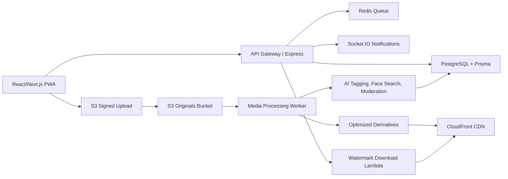

# Momentra Architecture

Momentra is designed as a scalable event media operating system for clubs, societies, and college communities.

## Core Services

- **Web app:** React/Vite demo today, production target can move to Next.js App Router for SSR, image optimization, and edge routes.
- **API:** Node.js + Express modules for authentication, events, uploads, social actions, AI jobs, and downloads.
- **Database:** PostgreSQL stores relational metadata, permissions, tags, comments, likes, favourites, and notification state.
- **Object storage:** AWS S3 stores originals, optimized images, thumbnails, and video derivatives behind CloudFront.
- **Realtime:** Socket.IO emits like, comment, tag, upload-complete, and album-ready events.
- **AI workers:** AWS Rekognition or face-api.js/OpenCV can generate tags, face vectors, duplicate hashes, moderation labels, and AI captions.

## Upload Flow

1. Photographer requests `/media/signed-upload` with album id, file name, and content type.
2. API validates `PHOTOGRAPHER` or higher role and returns a short-lived S3 signed URL.
3. Browser uploads directly to S3 and reports progress locally.
4. S3 event triggers a worker to compress, generate thumbnail/video preview, compute perceptual hash, moderate, tag, and index faces.
5. Worker writes metadata to PostgreSQL and emits realtime notifications.

## Authentication Flow

1. User signs up or logs in through JWT/OAuth provider.
2. API issues short-lived access token and an HTTP-only refresh token.
3. Protected routes verify JWT and run role middleware.
4. Album visibility is checked for every event/media query.
5. Downloads are generated through role-aware watermark policy.

## Access Matrix

| Capability | Admin | Photographer | Club Member | Viewer |
| --- | --- | --- | --- | --- |
| Create/edit events | Yes | No | No | No |
| Upload event media | Yes | Yes | Optional collaborative albums | No |
| View private albums | Yes | Assigned events | Member albums | No |
| Like/comment/save | Yes | Yes | Yes | Public only |
| Download originals | Yes | Own uploads | No | No |
| Download watermarked | Yes | Yes | Yes | Public only |
| Manage AI moderation | Yes | Review own uploads | No | No |

## Production Hardening

- Store refresh tokens in HTTP-only secure cookies with rotation.
- Add rate limits for auth, comments, search, signed uploads, and AI endpoints.
- Use background queues for media processing and AI indexing.
- Add CDN cache policies by derivative type.
- Use row-level permission checks for event and album membership.
- Log audit events for admin actions, private album access, and downloads.
- Add malware scanning for uploaded files.
- Add OpenTelemetry traces across upload, processing, and notification flows.
