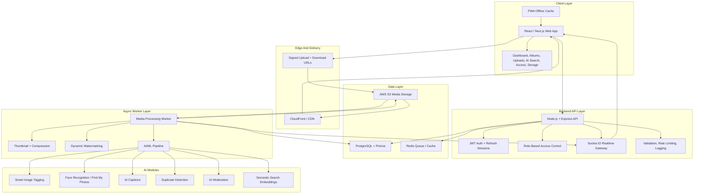
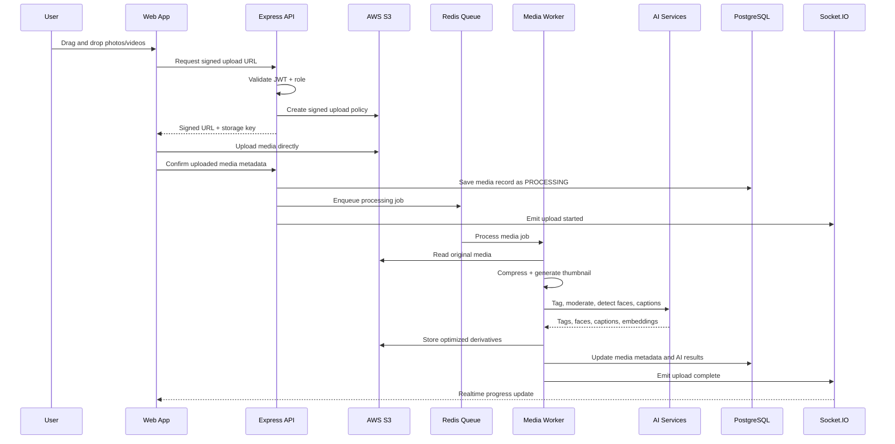
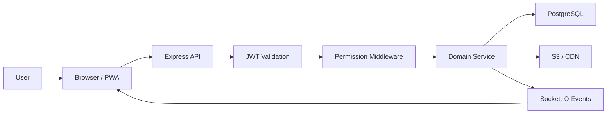
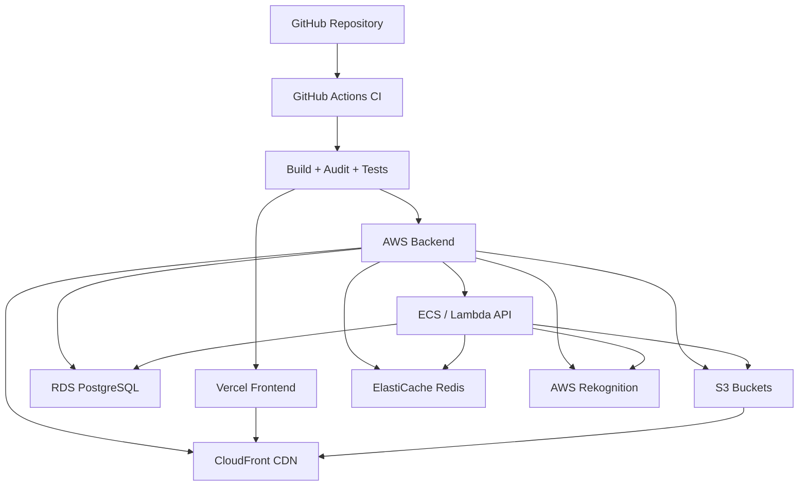

# Architecture Diagram

Momentra is designed as a SaaS-style event media platform combining Google Photos-style media management, Instagram-like social interactions, Drive-style storage, and AI-powered search.

## High-Level System Architecture

## Upload And AI Processing Flow

## Request Flow

## Role-Based Access

| Role | Capabilities |
| --- | --- |
| Admin | Create/edit events, manage albums, change roles, moderate content, manage private albums, download originals. |
| Photographer | Upload media, tag users, view assigned private albums, manage own uploads. |
| Club Member | View club albums, like, comment, save favourites, use Find My Photos. |
| Viewer | View public albums, share public links, download watermarked media. |

## Deployment Architecture

## Main Technology Choices

- **Frontend:** React / Next.js-ready architecture, responsive dashboard UI, PWA cache.
- **Backend:** Node.js + Express, REST APIs, JWT authentication, RBAC middleware.
- **Database:** PostgreSQL with Prisma schema.
- **Realtime:** Socket.IO for notifications, likes, comments, tags, uploads, and album updates.
- **Storage:** AWS S3 with signed URLs and CloudFront CDN.
- **Queues:** Redis-backed jobs for upload processing and AI indexing.
- **AI:** AWS Rekognition, face-api.js/OpenCV/TensorFlow-ready worker layer.
- **Deployment:** Vercel frontend, AWS backend, Docker Compose for local services.

Implementation docs: [`docs/ARCHITECTURE.md`](./ARCHITECTURE.md). API docs: [`docs/API.md`](./API.md).
