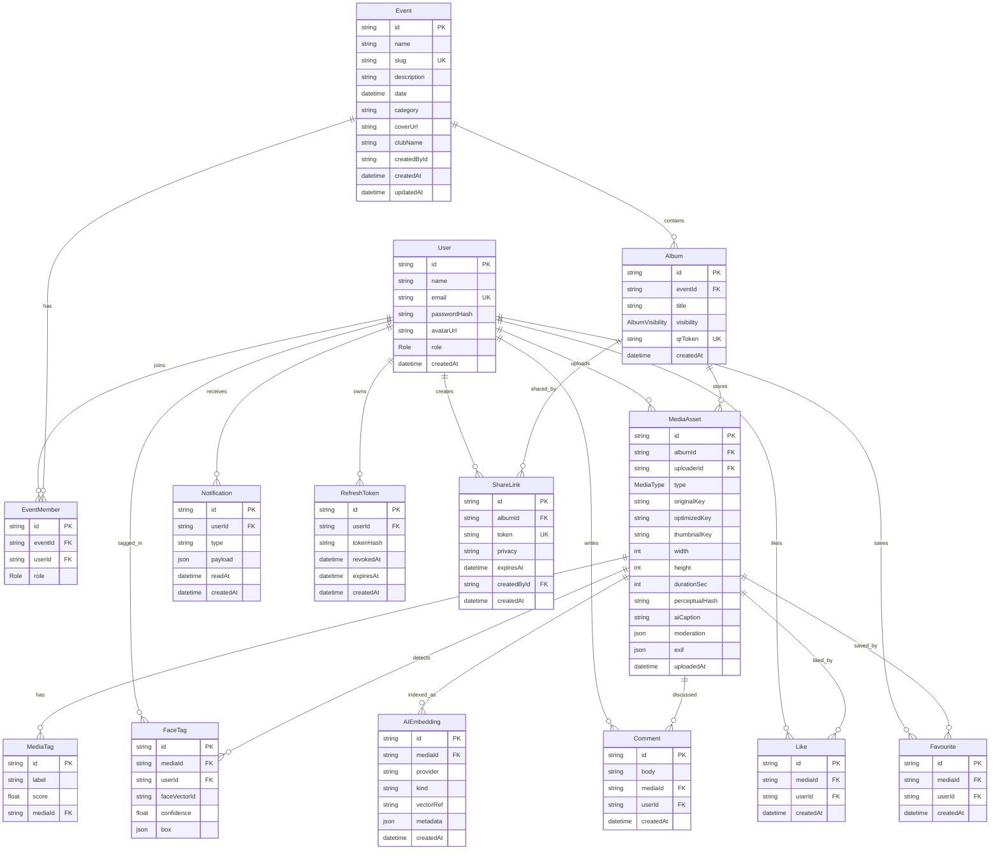

# Database Schema

Momentra uses a relational PostgreSQL schema modeled with Prisma. The schema supports authentication, RBAC, events, albums, media, comments, likes, favourites, AI tags, face matches, notifications, sharing, and refresh-token sessions.

## ER Diagram



## Core Tables

| Table | Purpose |
| --- | --- |
| `User` | Stores account identity, role, avatar, and authentication fields. |
| `Event` | Stores event metadata such as name, description, date, category, club name, and cover image. |
| `Album` | Event-wise album container with public/private/club-only visibility and QR token. |
| `MediaAsset` | Stores photo/video metadata, storage keys, thumbnails, AI captions, moderation, EXIF, and upload ownership. |
| `MediaTag` | AI-generated tags such as crowd, stage, workshop, mountains, concert, beach. |
| `FaceTag` | Face detection and recognition results for Find My Photos. |
| `AIEmbedding` | Vector index references for semantic search, face embeddings, and AI retrieval. |
| `Comment` | Media comments; production extension supports parent-child nested replies. |
| `Like` | Like relation with unique `mediaId + userId`. |
| `Favourite` | Saved/favourite media relation with unique `mediaId + userId`. |
| `EventMember` | Event membership and event-scoped role mapping. |
| `Notification` | Realtime notification records for likes, comments, tags, uploads, and album updates. |
| `ShareLink` | Expiring public/private share links used for QR sharing. |
| `RefreshToken` | Session persistence with revocation and expiry support. |

## Enums

```prisma
enum Role {
  ADMIN
  PHOTOGRAPHER
  CLUB_MEMBER
  VIEWER
}

enum AlbumVisibility {
  PUBLIC
  PRIVATE
  CLUB_ONLY
}

enum MediaType {
  PHOTO
  VIDEO
}
```

## Important Indexes And Constraints

- `User.email` is unique.
- `Event.slug` is unique.
- `Album.qrToken` is unique.
- `Like` has unique constraint on `mediaId + userId`.
- `Favourite` has unique constraint on `mediaId + userId`.
- `EventMember` has unique constraint on `eventId + userId`.
- `MediaTag.label` is indexed for tag search.
- `AIEmbedding.kind` and `AIEmbedding.provider` are indexed for AI retrieval.
- `ShareLink.expiresAt` is indexed for expiry cleanup.
- Cascade deletes are used from events to albums and from albums to media-related records.

Full Prisma schema: [`prisma/schema.prisma`](../prisma/schema.prisma).
